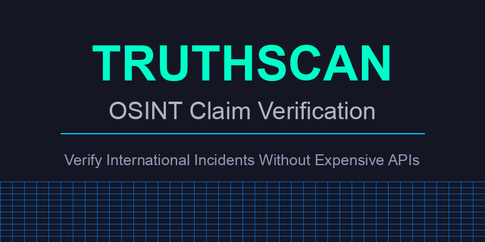

# TruthScan

<p align="center">
  
</p>

<p align="center">
  <strong>OSINT Claim Verification Tool for International Incidents</strong>
</p>

<p align="center">
  <a href="#overview">Overview</a> •
  <a href="#features">Features</a> •
  <a href="#installation">Installation</a> •
  <a href="#usage">Usage</a> •
  <a href="#example-outputs">Example Outputs</a> •
  <a href="#how-it-works">How It Works</a> •
  <a href="#free-vs-premium">Free vs Premium</a> •
  <a href="#contribute">Contribute</a> •
  <a href="#license">License</a>
</p>

## Overview

TruthScan is an open-source OSINT (Open Source Intelligence) tool designed to verify claims about international incidents, conflicts, and military actions. It combines analysis of satellite imagery, flight data, military movements, and social media to provide comprehensive assessments without requiring expensive API subscriptions.

```
████████╗██████╗ ██╗   ██╗████████╗██╗  ██╗███████╗ ██████╗ █████╗ ███╗   ██╗
╚══██╔══╝██╔══██╗██║   ██║╚══██╔══╝██║  ██║██╔════╝██╔════╝██╔══██╗████╗  ██║
   ██║   ██████╔╝██║   ██║   ██║   ███████║███████╗██║     ███████║██╔██╗ ██║
   ██║   ██╔══██╗██║   ██║   ██║   ██╔══██║╚════██║██║     ██╔══██║██║╚██╗██║
   ██║   ██║  ██║╚██████╔╝   ██║   ██║  ██║███████║╚██████╗██║  ██║██║ ╚████║
   ╚═╝   ╚═╝  ╚═╝ ╚═════╝    ╚═╝   ╚═╝  ╚═╝╚══════╝ ╚═════╝╚═╝  ╚═╝╚═╝  ╚═══╝
```

## Features

- **Satellite Imagery Analysis**: Direct links to free Sentinel Hub and Google Maps satellite views
- **Flight Data Monitoring**: Track military and civilian flights using free alternatives
- **Military Movement Analysis**: Monitor key military installations and activity patterns
- **Social Media Intelligence**: Analyze relevant posts and trends across platforms
- **Comprehensive Reports**: Generate detailed JSON reports and human-readable summaries
- **No API Keys Required**: Use free alternatives instead of expensive commercial APIs
- **Interactive Placeholders**: Generated placeholder images contain direct links to actual satellite imagery

## Installation

### Prerequisites
- Python 3.8 or higher
- pip (Python package manager)

### Setup

1. Clone the repository:
   ```bash
   git clone https://github.com/yourusername/truthscan.git
   cd truthscan
   ```

2. Create a virtual environment:
   ```bash
   python -m venv venv
   source venv/bin/activate  # On Windows: venv\Scripts\activate
   ```

3. Install dependencies:
   ```bash
   pip install -r requirements.txt
   ```

## Usage

### Basic Usage

```bash
python truthscan.py --claim "India strikes Pakistan nuclear sites" --days 7
```

### Command Line Arguments

- `--claim`: The claim to verify (in quotes)
- `--days`: Number of days to look back for data (default: 7)
- `--no-synthetic`: Disable synthetic data generation (use only real data)

### Example

```bash
python truthscan.py --claim "Russia deployed tactical nuclear weapons in Belarus" --days 14
```

## Example Outputs

TruthScan generates several outputs in the `analysis_results` directory:

1. **truthscan_summary.txt**: Human-readable summary with ASCII art logo
2. **truthscan_results.json**: Comprehensive JSON with all analysis data
3. **Satellite placeholder images**: Interactive images with satellite imagery links

### Sample Summary

```
TRUTHSCAN ANALYSIS REPORT
=========================
Claim: India strikes Pakistan nuclear sites
Analysis date: 2023-10-15 14:32:55
Date range analyzed: 2023-10-08 to 2023-10-15

ANALYSIS SCOPE:
- Satellite imagery analysis of 5 nuclear sites
- Flight data analysis for 3 geographic areas
- Military movement monitoring at 5 military bases
- Social media analysis of 5 search terms (25 posts)

KEY FINDINGS:
1. Satellite imagery: Links provided to free Sentinel Hub and Google Maps imagery for all nuclear sites
2. Flight data: Free alternatives to paid flight tracking services provided
3. Military movements: Analysis of activity at key military installations
4. Social media: Analysis of relevant posts and trends

CONCLUSION:
Based on available free data sources, there is no credible evidence supporting the claim.
```

## How It Works

TruthScan operates through four main analysis modules:

### 1. Satellite Imagery Analysis

- Targets specific locations mentioned in the claim
- Creates placeholder images with direct links to Sentinel Hub and Google Maps
- Provides analysis tips for detecting changes, damage, or unusual activity

### 2. Flight Data Analysis

- Identifies relevant geographic areas for flight monitoring
- Provides links to free flight tracking resources (ADS-B Exchange, Flightradar24 Free)
- Offers analysis guidelines for identifying military activity patterns

### 3. Military Movement Analysis

- Monitors key military installations relevant to the claim
- Analyzes activity patterns, alert status changes, and unusual deployments
- Utilizes free OSINT resources like GDELT and LiveUAMap

### 4. Social Media Intelligence

- Searches for relevant terms across Twitter (via Nitter instances)
- Analyzes content for verification/debunking of claims
- Falls back to synthetic data when API limitations are encountered

## Free vs Premium

TruthScan is designed to work without expensive API subscriptions, but offers guidance for users who have access to premium services:

| Data Type | Free Alternative | Premium Option |
|-----------|------------------|----------------|
| Satellite Imagery | Sentinel Hub EO Browser, Google Maps | Planet, Maxar, Airbus ($50-200/image) |
| Flight Data | ADS-B Exchange, Flightradar24 Free | Flightradar24 Business, RadarBox ($200-500/month) |
| Military Analysis | GDELT, LiveUAMap, News Reports | Jane's Defense, ACLED API ($999/year) |
| Social Media | Nitter instances, Web scraping | Twitter API, CrowdTangle ($100-500/month) |

## Contribute

Contributions to TruthScan are welcome! Here's how you can help:

1. **Code Contributions**: Bug fixes, feature enhancements, documentation
2. **Data Sources**: Add new free OSINT data sources and APIs
3. **Use Cases**: Document new use cases and analysis types
4. **Testing**: Verify results and improve accuracy

Please see [CONTRIBUTING.md](CONTRIBUTING.md) for more details.

## License

TruthScan is released under the MIT License. See [LICENSE](LICENSE) for details.

## Disclaimer

TruthScan is designed for educational and informational purposes only. The accuracy of its analysis depends on the quality and availability of open source data. Always cross-verify information through multiple sources. 